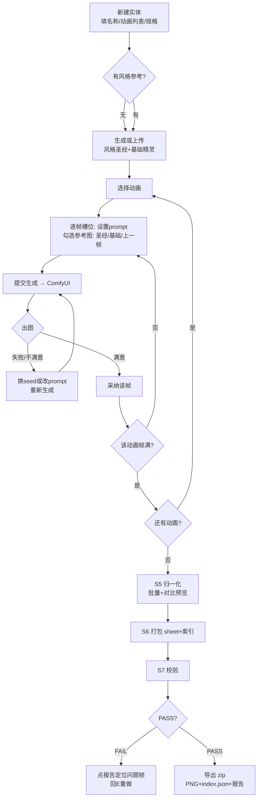

# PRD：PixelBench —— AI 2D 角色资产工作台

## 第 0 部分：文档信息

| 项 | 值 |
|---|---|
| 当前版本 | 0.1.0（初稿 + 中稿） |
| 当前阶段 | 需求评审 |
| 核心干系人 | 用户（唯一用户 / 产品 / 开发 / 测试） |
| 技术底座 | 本地 ComfyUI（Qwen-Image 2.1）+ Python 3.13 + 浏览器单页应用 |

### 更新记录

| 版本 | 状态 | 内容 |
|---|---|---|
| 0.1.0 | 初稿+中稿 | 背景/目标/范围（第1部分）+ 流程/信息架构（第2部分）+ 细节方案骨架（第3部分 TBD 项） |

---

## 第一部分：需求背景与目标

### 项目概述

**PixelBench** 是一个运行在本地浏览器的工作台，用来驱动"Qwen-Image 2.1 生成 → 人工审核 → 归一化 → 打包图集 → 校验 → 导出"的 2D 角色动画资产生产管线。它把现在散落在 CLI（`art_tools/asset_tool.py`）和 AI 工具调用里的流程，收拢成一个可视化的单页应用。

### 核心问题

1. **目标用户**：用户本人。单机（Windows + 本地 GPU），既当产品也当开发；未来可能给 1-2 个美术伙伴用（同一局域网）。
2. **场景**：黑日计划 2D 游戏开发中，需要批量制作角色动画资产（idle / walk / atkA 等）。一次会话 = 一个实体（entity，如"骑士"）的若干动画 × 每动画 8-16 帧的迭代。
3. **痛点**：
   - 现状管线是 CLI + AI 工具调用，上下文散在对话里，重试一次就要重新组织提示词
   - 生成候选图只能一张张看，无法并排比较、无法快速"换 seed 重roll"
   - 参考图锚定（风格圣经 + 基础精灵 + 上一帧）靠口头约定，容易漏
   - 归一化（S5）/打包（S6）/校验（S7）的结果是 JSON 和终端文本，不可视
   - 游戏占 GPU 时生成极慢，任务排队不可见、不可取消

### 用户故事

| # | 故事 |
|---|---|
| U1 | 作为开发者，我想要在一个页面里看到某个实体所有动画的所有帧，以便统一迭代风格和姿态 |
| U2 | 作为开发者，我想要并排比较同一帧的多个候选并一键换 seed 重试，以便快速定稿 |
| U3 | 作为开发者，我想要勾选参考图（风格圣经/基础精灵/上一帧）后再生成，以便保持角色一致性 |
| U4 | 作为开发者，我想要看到校验报告并点击问题定位到具体帧，以便不用人工核对脚底对齐和剪影漂移 |
| U5 | 作为开发者，我想要看到生成任务进度并随时取消，以便游戏占 GPU 时不空等 |
| U6 | 作为开发者，我想要一键导出 PNG 图集 + JSON 索引的 zip，以便直接进游戏工程 |

### 需求范围

**In-Scope（P0 核心闭环）**

- 实体管理：新建/切换/删除实体，编辑 spec（画布尺寸、动画列表、fps）
- 参考图管理：上传/生成/标记"风格圣经"和"基础精灵"
- 帧生成：文本生成（qwen_image_generate）+ 参考图编辑（qwen_image_edit）两种方式，参考图多选勾选
- 候选审阅：每帧最多 N 个候选并排，选定采纳；重试（换 seed / 改 prompt）
- S5 归一化：对采纳帧一键批量归一化，预览前后对比
- S6 打包：每动画生成 sheet + JSON 索引，sheet 预览
- S7 校验：报告展示（脚底稳定性 / 不透明占比 / 剪影 IoU），点击定位问题帧
- 导出：zip（帧 PNG + sheet + index.json + 校验报告）
- 任务状态：ComfyUI 在线状态、当前任务进度、取消按钮

**Out-of-Scope（本版本不做）**

- 像素风量化/网格吸附（HD 厚涂风格用不上，留 P2 按风格切换）
- `_n` 换色板变体 sheet（代码可后补，UI 不做）
- 帧的拖拽排序、关键帧插值
- 矢量编辑 / 画布内涂改
- 多引擎导出（Godot/Unity，本版本只出 PNG + JSON）
- 多用户协作、登录、云端同步
- 批量多实体并行生成

### 需求列表

| ID | 模块 | 描述 | 优先级 | 状态 |
|---|---|---|---|---|
| R001 | 实体管理 | 新建/切换/删除实体，spec 可编辑 | P0 | 规划中 |
| R002 | 参考图 | 上传/生成参考图，标记类型（圣经/基础/其他），勾选进生成 | P0 | 规划中 |
| R003 | 帧生成 | 逐帧生成（t2i / 参考图 edit），参数：prompt、seed、档位(fast/hq)、参考图选择 | P0 | 规划中 |
| R004 | 候选审阅 | 候选并排、采纳、重试（换 seed / 改 prompt） | P0 | 规划中 |
| R005 | 归一化 | 批量 S5，前后对比预览 | P0 | 规划中 |
| R006 | 打包 | S6 sheet + 索引，sheet 预览 | P0 | 规划中 |
| R007 | 校验 | S7 报告 + 问题帧定位 | P0 | 规划中 |
| R008 | 导出 | zip 打包下载 | P0 | 规划中 |
| R009 | 任务状态 | ComfyUI 状态、进度、取消 | P0 | 规划中 |
| R010 | 动画级操作 | 一键"全部重新生成"、按动画清空 | P1 | V2 考虑 |
| R011 | 批量 seed 探索 | 同 prompt 一次出 4 候选自动排队 | P1 | V2 考虑 |
| R012 | 风格模板 | spec 预设（HD厚涂/像素16色）切换 | P2 | 远期 |
| R013 | 局域网访问 | 美术伙伴通过 IP 访问 | P2 | 远期 |

---

## 第二部分：方案概述

### 核心业务流程



### 系统架构

```
浏览器（单页应用，vanilla JS，无构建步骤）
   │  fetch /api/*  +  EventSource 进度推送
   ▼
FastAPI 服务（localhost:8321，纯本地）
   ├─ /api/entities        实体 CRUD（磁盘持久化）
   ├─ /api/refs            参考图管理
   ├─ /api/frames          帧槽位状态（候选/采纳/错误）
   ├─ /api/generate        提交生成 → ComfyUI /prompt，返回 task_id
   ├─ /api/tasks/<id>      轮询 ComfyUI /history 进度与产物
   ├─ /api/tasks/<id>/cancel
   ├─ /api/normalize       调 asset_tool.normalize（纯 CPU）
   ├─ /api/pack            调 asset_tool.pack（纯 CPU）
   ├─ /api/validate        调 asset_tool.validate（纯 CPU）
   └─ /api/export          zip 流式下载
   ▼
ComfyUI（127.0.0.1:8188，GPU）—— 唯一 GPU 依赖
   ▼
workspaces/<project>/        一个项目 = 一个游戏（永蚀 / 未来的其他项目）
   ├─ project.json           项目元信息（项目名/游戏名/备注）
   └─ <entity>/
      ├─ spec.json           实体级规格（继承全局 spec + 覆盖）
      ├─ refs/               风格圣经、基础精灵、其他参考
      ├─ candidates/<anim>/<i>/  候选（未采纳，最多保留 3 张）
      ├─ <anim>_NNN.png      采纳帧（工作台根，扁平，供 S5-S7 直接读）
      ├─ normalized/         S5 产物
      ├─ sheets/             S6 产物 + index.json
      └─ validation.json     S7 报告
```

**定位：PixelBench 是独立工具，不隶属于任何单个游戏。** 游戏（永蚀）只是"项目"列表里的一项；工作台本身可服务任意 2D 项目。

关键决策：
- **前端零构建**：单 HTML + 原生 JS，刷新即最新，部署=拷目录
- **所有状态落盘**：刷新页面不丢任何东西（workspace 目录即数据库）
- **CPU/GPU 分离**：S5-S7 和 UI 永远可用，只有 `/api/generate` 依赖 ComfyUI；ComfyUI 离线时 UI 顶部横幅提示，其余功能照常用
- **ComfyUI 交互**：后端直接调 ComfyUI HTTP API（/prompt、/history、/view），不经过 AI 工具层

### 信息架构

```
工作台（单页，三栏布局）
├─ 左栏（250px）：
│   ├─ 项目列表 + 新建项目（一个项目 = 一个游戏；永蚀只是其中之一）
│   ├─ 实体列表 + 新建按钮
│   └─ 实体 spec 快捷编辑 + 参考图管理
├─ 中栏（主区）：
│   ├─ 顶部：动画 tab（idle / walk / atkA …）+ 动画级操作
│   ├─ 帧网格：每行一帧槽位
│   │   ├─ 帧号 + 状态徽章（空/生成中/待审阅/已采纳/错误）
│   │   ├─ 候选缩略图（横排，可放大）
│   │   └─ 采纳后的归一化缩略图
│   └─ 底部状态条：ComfyUI 状态 / 当前任务进度 / 校验报告入口
└─ 右栏（320px，选中帧时出现）：
    ├─ prompt 编辑框
    ├─ 参考图勾选列表（风格圣经/基础精灵/上一帧/其他，带缩略图）
    ├─ 参数：seed（留空=随机）/ 档位 fast|hq / 尺寸
    └─ 按钮：生成 / 重试(换seed) / 采纳 / 放弃候选
└─ 模态层：
    ├─ 大图预览（候选对比）
    ├─ 归一化前后对比
    ├─ sheet 预览
    ├─ 校验报告（问题列表可点击 → 定位帧）
    └─ 导出确认
```

---

## 第三部分：细节方案（骨架，评审后细化为定稿）

### 帧槽位状态机

| 状态 | 说明 | 可执行操作 |
|---|---|---|
| `empty` | 未生成 | 设置 prompt、勾选参考、生成 |
| `generating` | ComfyUI 处理中 | 显示进度、取消 |
| `review` | 有候选待审阅 | 采纳任一候选、生成更多候选、放弃全部 |
| `adopted` | 已采纳 | 归一化后显示；可"重roll"回到 review |
| `error` | 生成失败 | 显示错误原因、重试 |

### 关键交互（P0）

| 场景 | 交互 |
|---|---|
| 生成一帧 | 右栏填 prompt → 勾选参考图 → 点"生成"→ 槽位进入 generating，进度条实时更新 |
| 重试 | 采纳前：换 seed 或改 prompt 再生成（旧候选保留 3 张，可回滚选择） |
| 采纳 | 点候选 → 该帧 adopted，右栏显示归一化后缩略图 |
| 批量归一化 | 动画 tab 上"全部归一化"→ 逐帧 S5 → 弹出前后对比滑条 |
| 校验定位 | 报告行（帧号+问题）点击 → 中栏滚动到该帧并高亮 |
| 导出 | 底部"导出"→ 确认弹窗列出内容清单 → 浏览器下载 zip |

### 边缘情况（初版清单，定稿补全）

| 情况 | 处理 |
|---|---|
| ComfyUI 离线 | 顶部红色横幅；生成按钮禁用；其他功能正常 |
| 生成超时（>20min，游戏占 GPU 场景） | 可手动取消；候选区显示"已取消" |
| 快速连点"生成" | 按钮 1s 防抖 |
| 刷新页面 | 全部状态从磁盘恢复，进行中的任务继续轮询 |
| 实体删除 | 二次确认（不可恢复，直接删 workspace 目录） |
| 磁盘产物过大 | 未采纳候选超过 3 张自动清理最旧的 |
| 空实体 | 帧网格显示空状态提示"还没有帧，从右栏设置开始" |
| 参考图未选任何 | 允许（纯文生图），但 edit 模式未勾选时提示 |
| 校验 FAIL | 不阻塞导出，导出前提示"带 FAIL 报告导出" |

### 非功能性需求

| 类型 | 要求 |
|---|---|
| 性能 | 帧网格 16 帧 × 3 候选缩略图加载 < 1s（本地图）；UI 操作响应 < 100ms |
| 兼容 | Chrome/Edge 最新即可，不追求移动端 |
| 数据 | 全本地，`workspaces/` 即数据库；无后端数据库 |
| 可观测 | 服务端日志写 `bench.log`；API 错误统一返回 `{error: msg}` |
| 资源 | 1024px 帧预览用浏览器原生 ``，不引入 canvas 重绘（像素对比留 P2） |

---

## 第四部分：上线计划（草案）

| 阶段 | 内容 | 里程碑 |
|---|---|---|
| M1 核心闭环 | R001-R004 + R009（实体/参考图/生成/审阅/任务状态） | 能在 UI 里生成并采纳 3 个动画的完整帧 |
| M2 生产闭环 | R005-R008（归一化/打包/校验/导出） | 一个实体从生成到 zip 全 UI 完成 |
| M3 增强 | R010-R011（动画级批量、seed 探索） | V2 |

排期待评审后定（单人开发，M1 预计 1-2 天，M2 预计 1 天）。

### 待评审确认项

| # | 问题 | 当前倾向 |
|---|---|---|
| Q1 | 每帧最多保留几个候选？ | 3 个（更多排队浪费 GPU） |
| Q2 | 生成档位默认值？ | fast(1024) 迭代，hq(2K) 定稿前重出 |
| Q3 | 服务端口？ | 8321（避开 3080/8188） |
| Q4 | M1 要不要包含风格圣经生成（S1）？ | 要，作为"生成参考图"入口，复用同一个生成 API |

### Git / PR 工作流

| 项 | 约定 |
|---|---|
| 远端 | `origin` = `https://github.com/juemin4-source/pixelbench.git`（本工作台独立仓） |
| 分支模型 | `main` 只收 PR；功能分支 `feat/<scope>`，修复 `fix/<scope>` |
| 提交规范 | `type(scope): 中文描述`（feat/fix/refactor/docs/chore） |
| PR 流程 | 分支 push 后开 PR → 自审清单（测试/验证证据/边界情况）→ 合并到 main（squash） |
| PR 描述模板 | 动机 / 改动点 / 验证方式 / 截图（UI 变更必须） |
| 本工作台范围 | 本仓库全部代码 + 文档；`workspaces/` 大产物不入库（.gitignore） |
| 与游戏仓的关系 | 游戏《永蚀》原型在独立仓 [juemin4-source/ever-eclipse](https://github.com/juemin4-source/ever-eclipse)；本工作台服务多个项目，不隶属任何单个游戏 |
